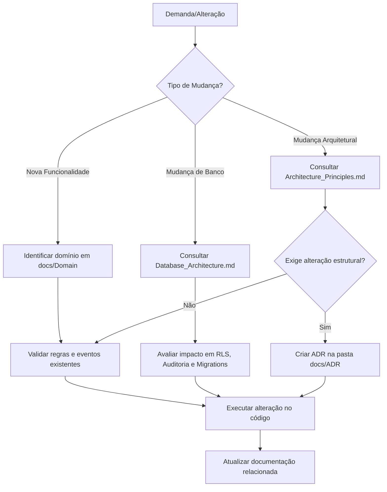

# Documentation Index

## Objetivo

O `Documentation_Index.md` é o ponto de entrada principal e o portal de governança da documentação do **FUTSTATS**.

Seu objetivo é orientar desenvolvedores, arquitetos, product owners, QAs e assistentes de Inteligência Artificial sobre a localização de cada documento normativo, a hierarquia a ser seguida em caso de conflitos e os fluxos de trabalho exigidos no projeto.

> [!NOTE]
> Este arquivo atua como um **direcionador de referências**. Ele não duplica regras específicas de arquitetura, backend, banco de dados ou IA, que possuem seus próprios documentos canônicos dentro do diretório [docs](file:///D:/xampp/htdocs/futstats-app/docs).

---

## Princípios da Documentação

1. **Uma fonte de verdade por assunto**: Cada decisão reside em um único arquivo de referência técnica.
2. **Menos duplicação, mais referência cruzada**: Evita-se a cópia de regras de negócio ou de código entre documentos.
3. **Código e documentação evoluem juntos**: Mudanças significativas nas regras de domínio ou infraestrutura exigem a atualização dos respectivos arquivos técnicos.
4. **Foco no Domínio**: A explicação do negócio antecede a documentação de infraestrutura tecnológica.

---

## Hierarquia Documental

Em caso de divergência ou conflito conceitual entre os documentos do projeto, a seguinte ordem de prevalência deve ser respeitada:

1. `Project_Constitution.md` (quando existente).
2. [Architecture_Principles.md](file:///D:/xampp/htdocs/futstats-app/docs/Architecture/Architecture_Principles.md).
3. `Documentation_Index.md` (este documento).
4. Documentos normativos da área afetada (ex: [Database_Architecture.md](file:///D:/xampp/htdocs/futstats-app/docs/Database/Database_Architecture.md)).
5. Documentos de domínio (localizados em [docs/Domain](file:///D:/xampp/htdocs/futstats-app/docs/Domain)).
6. Especificações técnicas de implementação e guias operacionais.

---

## Leitura Essencial e Estrutura

### Ordem Recomendada de Leitura
Para compreender o projeto de forma holística, siga esta ordem de leitura:
1. [README.md](file:///D:/xampp/htdocs/futstats-app/docs/README.md)
2. `Documentation_Index.md` (este documento)
3. [Product_Overview.md](file:///D:/xampp/htdocs/futstats-app/docs/Product/Product_Overview.md)
4. [Product_Vision.md](file:///D:/xampp/htdocs/futstats-app/docs/Product/Product_Vision.md)
5. [Product_Principles.md](file:///D:/xampp/htdocs/futstats-app/docs/Product/Product_Principles.md)
6. [Domain/README.md](file:///D:/xampp/htdocs/futstats-app/docs/Domain/README.md)
7. [Architecture_Principles.md](file:///D:/xampp/htdocs/futstats-app/docs/Architecture/Architecture_Principles.md)
8. [Recommended_Project_Structure.md](file:///D:/xampp/htdocs/futstats-app/docs/Architecture/Recommended_Project_Structure.md)
9. [Backend_Architecture.md](file:///D:/xampp/htdocs/futstats-app/docs/Backend/Backend_Architecture.md)
10. [Database_Architecture.md](file:///D:/xampp/htdocs/futstats-app/docs/Database/Database_Architecture.md)
11. [Event_Driven_Strategy.md](file:///D:/xampp/htdocs/futstats-app/docs/Architecture/Event_Driven_Strategy.md)
12. [Jobs_and_Queues.md](file:///D:/xampp/htdocs/futstats-app/docs/Backend/Jobs_and_Queues.md)
13. [AI_Development_Guidelines.md](file:///D:/xampp/htdocs/futstats-app/docs/AI/AI_Development_Guidelines.md)
14. [Handoff_Guide.md](file:///D:/xampp/htdocs/futstats-app/docs/Release_1_0/Handoff_Guide.md)

### Guia das Áreas e Pastas do Projeto
A documentação está dividida nas seguintes pastas e especializações:
* [Product/](file:///D:/xampp/htdocs/futstats-app/docs/Product): Visão do produto, princípios, roadmap, personas e UX conceitual.
* [Domain/](file:///D:/xampp/htdocs/futstats-app/docs/Domain): Definições lógicas das áreas de negócio (Teams, Matches, Players, etc.).
* [Architecture/](file:///D:/xampp/htdocs/futstats-app/docs/Architecture): Princípios estruturais, mapeamento de eventos e estratégias de offline e mídia.
* [Backend/](file:///D:/xampp/htdocs/futstats-app/docs/Backend): Arquitetura de serviços, casos de uso, jobs e regras de fila.
* [Database/](file:///D:/xampp/htdocs/futstats-app/docs/Database): Esquema de tabelas, relacionamentos físicos, Row Level Security (RLS) e migrations.
* [Frontend/](file:///D:/xampp/htdocs/futstats-app/docs/Frontend): Estrutura do app móvel, gerenciamento de estado local e offline.
* [API/](file:///D:/xampp/htdocs/futstats-app/docs/API): Contratos, convenções de endpoints e rate limiting.
* [UX/](file:///D:/xampp/htdocs/futstats-app/docs/UX): Fluxos de telas, estados vazios e acessibilidade.
* [AI/](file:///D:/xampp/htdocs/futstats-app/docs/AI): Diretrizes para geração de código e atuação de agentes assistidos por IA.
* [QA/](file:///D:/xampp/htdocs/futstats-app/docs/QA): Estratégia de testes, massa de dados e critérios de aceitação.
* [Security/](file:///D:/xampp/htdocs/futstats-app/docs/Security): Controles de acesso baseados em papéis (RBAC), privacidade de dados e moderação.
* [Operations/](file:///D:/xampp/htdocs/futstats-app/docs/Operations): Guias de deploy, backups, incidentes e observabilidade.
* [Monetization/](file:///D:/xampp/htdocs/futstats-app/docs/Monetization): Estratégia comercial e gating de planos de uso.
* [Analytics/](file:///D:/xampp/htdocs/futstats-app/docs/Analytics): Rastreamento de métricas do produto e North Star Metric.
* [ADR/](file:///D:/xampp/htdocs/futstats-app/docs/ADR): Registros formais de decisões arquiteturais do projeto.
* [Implementation/](file:///D:/xampp/htdocs/futstats-app/docs/Implementation): Especificações técnicas refinadas para desenvolvimento e backlog de sprints.
* [Release_1_0/](file:///D:/xampp/htdocs/futstats-app/docs/Release_1_0): Handoff técnico, checklists de encerramento e validação da V1.

---

## Fluxos de Trabalho Recomendados

### Fluxo para Agentes de IA
Antes de realizar qualquer alteração estrutural ou gerar código, as IAs devem seguir o fluxo de conformidade:
1. Consultar [AI_Development_Framework.md](file:///D:/xampp/htdocs/futstats-app/docs/AI/AI_Development_Framework.md).
2. Seguir as regras de design de código de [AI_Development_Guidelines.md](file:///D:/xampp/htdocs/futstats-app/docs/AI/AI_Development_Guidelines.md).
3. Identificar as responsabilidades correspondentes em [Agent_Roles.md](file:///D:/xampp/htdocs/futstats-app/docs/AI/Agent_Roles.md) e validar a decisão por meio de [Decision_Protocols.md](file:///D:/xampp/htdocs/futstats-app/docs/AI/Decision_Protocols.md).

### Fluxos para Tomada de Decisão Técnica

#### 1. Criar Nova Funcionalidade
1. Identifique o domínio correspondente na pasta [docs/Domain](file:///D:/xampp/htdocs/futstats-app/docs/Domain).
2. Verifique o impacto nas tabelas correspondentes através de [Database_Architecture.md](file:///D:/xampp/htdocs/futstats-app/docs/Database/Database_Architecture.md).
3. Avalie se a ação deve disparar um evento de domínio ([Event_Driven_Strategy.md](file:///D:/xampp/htdocs/futstats-app/docs/Architecture/Event_Driven_Strategy.md)).
4. Codifique a regra de negócio na camada interna (`domain`/`application`) e implemente adapters na camada de infraestrutura (`infra`).
5. Escreva testes de aceitação e atualize as referências da documentação.

#### 2. Modificar o Banco de Dados
1. Consulte as convenções e a estratégia técnica em [Database_Architecture.md](file:///D:/xampp/htdocs/futstats-app/docs/Database/Database_Architecture.md).
2. Verifique o impacto em Row Level Security (RLS) e índices de performance.
3. Certifique-se de que a alteração não joga regras de negócio críticas em Triggers ou Procedures.
4. Registre a alteração na tabela de especificações em [docs/Implementation/Database](file:///D:/xampp/htdocs/futstats-app/docs/Implementation/Database).

#### 3. Alteração Arquitetural
1. Consulte os princípios estruturais em [Architecture_Principles.md](file:///D:/xampp/htdocs/futstats-app/docs/Architecture/Architecture_Principles.md).
2. Se a mudança afetar o comportamento global dos módulos ou mudar bibliotecas centrais de infraestrutura, crie uma nova **ADR (Architectural Decision Record)** na pasta [docs/ADR](file:///D:/xampp/htdocs/futstats-app/docs/ADR) utilizando o [ADR_Template.md](file:///D:/xampp/htdocs/futstats-app/docs/Templates/ADR_Template.md).

---

## Diretrizes de Governança Documental

### Tipos de Documentos Aceitos
* **Normative**: Define as regras oficiais que *devem* ser seguidas pelo código (ex: Princípios Arquiteturais, Diretrizes de Banco).
* **Reference**: Explica o negócio ou o modelo de dados (ex: Especificações de Domínio, Diagramas de Entidade-Relacionamento).
* **Guide**: Instruções passo-a-passo (ex: onboarding, guias de testes ou prompting).
* **Operational**: Detalha rotinas físicas de infraestrutura (deploy, observabilidade, backups).
* **Historical**: Registra o histórico e decisões de design passadas que não refletem mais o estado oficial do projeto (ex: ADRs obsoletas ou rascunhos consolidados).

### Processo para Novo Documento ou Atualização
* **Frontmatter obrigatório**: Cada arquivo `.md` técnico deve conter metadados declarando `title`, `status`, `document_type`, `version` e `related_documents`.
* **Idioma Canônico**:
  - Regras de negócio, guias de produto e explicações conceituais em **Português**.
  - Identificadores técnicos, código-fonte, tabelas do banco, APIs, enums e eventos de negócio em **Inglês**.

---

## Checklists de Validação Técnica

### Checklist para Pull Requests
Antes de submeter ou aprovar uma alteração, certifique-se de que:
* [ ] O código foi separado respeitando as fronteiras de módulos do monólito.
* [ ] Nenhuma regra de negócio vazou para a camada de apresentação (`presentation`) ou infraestrutura (`infra`).
* [ ] A implementação do banco respeita as políticas de RLS e auditoria padrão.
* [ ] Os domínios se comunicam por eventos em caso de efeitos colaterais.
* [ ] A documentação associada na pasta `docs/` foi atualizada e as versões de frontmatter incrementadas.
* [ ] Se necessário, uma nova ADR foi criada na pasta [docs/ADR](file:///D:/xampp/htdocs/futstats-app/docs/ADR).

### Checklist de Novas Funcionalidades
* [ ] Foi identificada a entidade de domínio principal correspondente.
* [ ] Os dados expostos cumprem os critérios de privacidade e segurança definidos em [Security](file:///D:/xampp/htdocs/futstats-app/docs/Security).
* [ ] Testes automatizados (unitários de domínio e integração de casos de uso) foram executados com sucesso.
